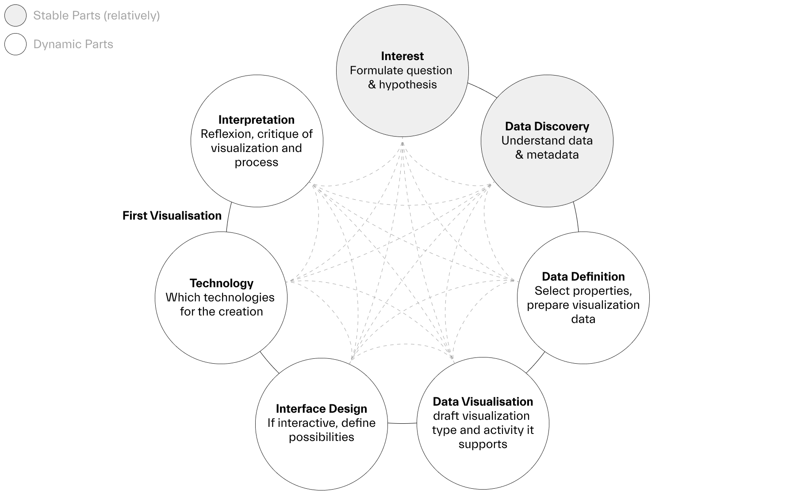

# Visualizing Cultural Heritage

Welcome! This is the repository for the workshop «Visualizing Cultural Heritage» taking place at the Basel Codes Day 2023 in Basel. 

We will use generative design and creative coding to visually explore the historical photo collection Ernst Brunner (1901–1979) consisting of approximately 48'000 black-and-white negatives documenting large parts of Switzerland. 

## Workshop Program

1. **Introduction**: The generative design workflow, the data and it's structure, the starter-code
2. **Pair-programming**: Formulate a question towards the collection, sketch out ideas, write some code, analyze the results, repeat the process and reflect how your knowledge and position changes.
3. **Wrap up**: Assess your visualization Upload your code to Github or share it via Airdrop, followed by a brief show & tell in the group and a discussion to share thoughts and observations. 

## The Data/Collection

The collection [Ernst Brunner](https://archiv.sgv-sstp.ch/collection/sgv_12/all/1) is the biggest collection from the archive of the Swiss Society for Folklore Studies (SSFS) in Basel and one of three collections examined in the SNSF research project [«Participatory Knowledge Practices in Analogue and Digital Image Archives (PIA)»](https://about.participatory-archives.ch/).

Ernst Brunner's photography is usually described as painting a peasant and rural picture of Switzerland. Although a large body of his work is concerned with agriculture and craftsmanship, consequently many of his photographs document the everyday live of farmers in rural Switzerland and the Alps, it is not limited to it and also includes images about live in cities, industry, construction projects or military service.

Looking at it from today's point of view, *how can different social constructs, such as gender, race, religion or labour, that are depicted in the images, be visualized to understand the norms and the marginalised?*

## Generative Data Design

Data is not a mirror of the world and a visualization is not a mirror of data. Neither are neutral nor objective. Both are arguments. And we should craft them with the same care we use when writing or speaking. To support us in this process of visual argumentation we use the generative workflow.

1. **Interest:** What is your interest and question? What is your hypothesis?
2. **Data Discovery:** What's the collection about? What kind of knowledge does it hold? Which ontology is used for the digital representation? What properties are available for the different metadata classes? Of what data type are the values of these properties?
3. **Data Definition:** What is the data subset we will visualize? Of what data type is it?
4. **Data Visualization:** What type of visualization are you making (e.g. timeline, map, diagramm, network)? What interpretative activity should it support (e.g. understand time/space, compare quantities)?
5. **Interface Design:** If your visualization is not static, what interaction is possible? How does it support the interpretation of the data?
6. **Technology:** In this workshop we will use P5 which is generally considered inclusive and accessible. This point asks in which context such tools emerged and what values they inherit.
7. **Interpretation:** Throughout the whole design process you will, intentionally and unintentionally, assess your visualisation. Does the visualisation answer my question (or not)? What insights have I gained (or not)? What new hypotheses have emerged in the process?

## Visualization Assessement

To critically assess your visualization, here are some possible considerations: 

- **Disclosure:** How do you communicate your assumptions, interest and decisions behind the visualisation? Do you disclose limitations of the data?
- **Context:** Does your visualisation respond to the specific context of the data, such as the circumstances of its creation? Do you consider the place, time, and people involved in the data creation?
- **Plurality:** Do you present multiple views of the data? How do they differ? Which perspectives are emphasised or hidden? Are you overemphasising data points? Do you give special attention to minorities?
- **Empowerment:** How does the visualisation influence, manipulate, and/or empower people? 
- **Harm:** Which people and groups are affected by your work? Could your visualisation cause harm in any way?
- **Norms:** How (and why) does your visualisation challenge visual, technical, methodological, cultural and/or social norms? An in turn, which norms does your visualisation stabilise?
- **Accessibility:** Is the data and source code open and available to viewers? Does your visualisation work for people with disabilities, such as, colour blindness, or limited technological resources such as internet bandwidth, outdated browsers, or small screens? 

